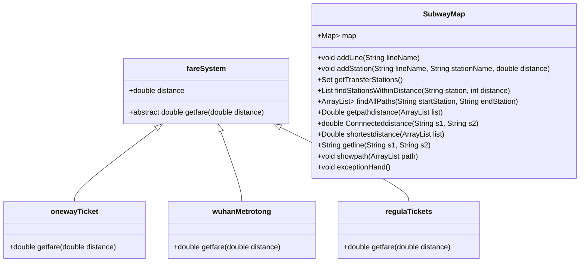

# 武汉地铁系统模拟大作业

[toc]

## 项目介绍

本项目旨在模拟武汉地铁系统的运行，包括地铁线路的管理、站点之间的距离计算、票价计算等功能。项目通过面向对象的方式，使用Java语言实现。

## 功能特点

1. **线路和站点管理**：可以添加和管理不同的地铁线路以及各个站点。
2. **票价计算**：根据不同的距离，使用不同的票价计算策略来计算票价。
3. **中转站查询**：可以查询所有中转站的信息。
4. **站点查找**：输入一个站点，可以查找在一定距离内的所有站点。
5. **路径规划**：输入起点和终点，可以找到所有可能的路径，并计算最短路径。
6. **异常处理**：对用户输入进行异常处理，确保程序的健壮性。

## 类图与用例图

为使读者更好理解代码的框架结构和运作流程，这里附上类图和用例图。

## 使用方法

### 环境要求

- Java Development Kit (`JDK`) 1.8 或更高版本
- 任何支持Java的`IDE`（如`IntelliJ IDEA`, `Eclipse`，`VScode`等）

### 步骤

1. **导入项目**：将项目代码导入到你的IDE中。
2. **运行测试**：运行`Test.java`中的`main`方法，这将读取`subway.txt`文件中的地铁线路和站点数据，并执行测试。
3. **添加线路和站点**：通过`SubwayMap`类的`addLine`和`addStation`方法添加地铁线路和站点。
4. **计算票价**：使用`fareSystem`的子类（如`onewayTicket`, `wuhanMetrotong`, `regulaTickets`）的`getfare`方法来计算票价。
5. **查询中转站**：使用`SubwayMap`类的`getTransferStations`方法查询中转站。
6. **查找站点**：使用`SubwayMap`类的`findStationsWithinDistance`方法查找特定站点周围的站点。
7. **路径规划**：使用`SubwayMap`类的`findAllPaths`方法进行路径规划，并找到最短路径

### 注意事项

- 确保`subway.txt`文件的路径正确，以便正确读取地铁线路和站点数据。
- 在实际部署前，请对代码进行充分的测试，以确保所有功能按预期工作。

## 结果展示

### 地铁网络图

函数从文件`subw.txt`读出信息并构建了整个地铁网络如下

[{径河=1.11, 三店=1.971, 码头潭公园=1.037, 东吴大道=1.652, 五环大道=1.655, 额头湾=0.944, 竹叶海=0.807, 舵落口=1.435, 古田一路=1.518, 古田二路=0.907, 古田三路=0.795, 古田四路=0.82, 汉西一路=0.921, 宗关=1.58, 太平洋=1.045, 硚口路=1.142, 崇仁路=0.88, 利济北路=0.888, 友谊路=0.986, 循礼门=1.083, 大智路=1.01, 三阳路=1.155, 黄浦路=1.203, 头道街=0.915, 二七路=0.795, 徐州新村=1.525, 丹水池=1.437, 新荣=1.165, 堤角=1.025, 滕子岗=1.12, 滠口新城=3.41, 汉口北=3.41}, {天河机场=6.004, 航空总部=1.426, 宋家岗=2.04, 巨龙大道=1.643, 盘龙城=3.945, 宏图大道=2.887, 常青城=2.012, 金银潭=1.092, 常青花园=1.725, 长港路=1.407, 汉口火车站=1.216, 范湖=1.41, 王家墩东=1.002, 青年路=0.946, 中山公园=1.543, 循礼门=0.897, 江汉路=3.292, 积玉桥=1.579, 螃蟹岬=0.93, 小龟山=1.168, 洪山广场=0.966, 中南路=1.418, 宝通寺=1.238, 街道口=0.951, 广埠屯=1.613, 虎泉=1.442, 杨家湾=1.317, 光谷广场=0.794, 珞雄路=1.009, 华中科技大学=0.817, 光谷大道=1.368, 佳园路=1.487, 武汉东站=1.059, 黄龙山路=2.038, 金融港北=1.603, 秀湖=1.999, 藏龙东街=1.021, 佛祖岭=1.021}, {沌阳大道=1.449, 东风公司=0.842, 体育中心=1.454, 三角湖=1.563, 汉阳客运=0.928, 四新大道=1.359, 陶家岭=0.906, 龙阳村=1.107, 王家湾=2.531, 宗关=0.982, 双墩=1.825, 武汉商务区=1.227, 云飞路=0.885, 范湖=1.676, 菱角湖=0.932, 香港路=0.934, 惠济二路=0.896, 赵家条=0.882, 罗家庄=0.759, 二七小路=1.253, 兴业路=1.181, 后湖大道=1.667, 市民之家=2.422, 宏图大道=2.422}, {黄金口=2.762, 孟家铺=1.479, 永安堂=1.243, 玉龙路=0.901, 王家湾=0.95, 十里铺=1.204, 七里庙=1.124, 五里墩=1.012, 汉阳火车站=1.574, 钟家村=0.834, 拦江路=3.278, 复兴路=0.718, 首义路=0.897, 武昌火车站=0.9, 梅苑小区=1.095, 中南路=0.966, 洪山广场=1.077, 楚河汉街=1.226, 青鱼嘴=1.048, 东亭=0.928, 岳家嘴=1.032, 铁机路=1.171, 罗家港=1.036, 园林路=1.333, 仁和路=1.634, 工业四路=1.173, 杨春湖=0.81, 武汉火车站=0.81}, {武汉站东广场=1.031, 厂前=1.432, 武钢=1.884, 工人村=1.555, 青宜居=1.857, 红钢城=1.627, 和平公园=1.231, 建设二路=1.374, 科普公园=1.601, 余家头=1.283, 杨园铁四院=1.213, 徐家棚=1.261, 三角路=1.838, 三层楼=1.07, 积玉桥=0.834, 昙华林武胜门=0.878, 司门口黄鹤楼=0.603, 彭刘杨=0.866, 复兴路=1.51, 八铺街=1.307, 烽火村=1.603, 张家湾=1.868, 光霞=1.103, 白沙六路=3.732, 中医药大学=1.302, 黄家湖（武科大）=1.353, 红霞=1.353}, {东风公司=1.297, 车城东路=2.279, 江城大道=2.805, 老关村=1.826, 国博中心南=0.756, 国博中心北=1.525, 前进村=0.953, 建港=1.478, 马鹦路=1.282, 钟家村=0.933, 琴台=1.857, 武胜路=0.762, 汉正街=0.977, 六渡桥=0.851, 江汉路=1.553, 大智路=0.804, 苗栗路=0.864, 香港路=1.024, 三眼桥=0.953, 唐家墩=1.477, 石桥=0.844, 杨汊湖=2.11, 常青花园=0.961, 轻工大学=1.202, 园博园北=1.748, 金银湖=2.391, 金银湖公园=2.391}, {横店=2.336, 裕福路=2.38, 天阳大道=4.479, 腾龙大道=1.809, 巨龙大道=2.524, 汤云海=5.154, 马池=2.208, 园博园北=2.137, 园博园=1.885, 常码头=1.586, 武汉商务区=1.482, 王家墩东=1.164, 取水楼=1.458, 香港路=1.846, 三阳路=3.502, 徐家棚=1.591, 湖北大学=2.067, 新河街=1.141, 螃蟹岬=0.859, 小东门=1.374, 武昌火车站=1.86, 瑞安街=1.383, 建安街=2.294, 湖工大=1.067, 板桥=1.717, 野芷湖=2.391, 新路村=3.438, 大花岭=2.507, 江夏客厅=2.0, 谭鑫培公园=1.61, 北华街=1.361, 纸坊大街=3.243, 青龙山地铁小镇=3.243}, {金潭路=0.855, 宏图大道=1.89, 塔子湖=1.648, 中一路=1.574, 竹叶山=1.394, 赵家条=1.419, 黄浦路=3.494, 徐家棚=0.992, 徐东=0.747, 汪家墩=1.318, 岳家嘴=0.873, 梨园=1.881, 省博湖北日报=1.326, 中南医院=1.239, 水果湖=0.758, 洪山路=1.812, 小洪山=1.307, 街道口=1.172, 马房山=1.7, 文治街=1.952, 文昌路=1.686, 省农科院=1.1, 马湖=1.228, 野芷湖=3.748, 黄家湖地铁小镇=1.084, 军运村=1.084, 后湖大道=0.985, 百步亭花园路=1.759, 新荣客运站=2.042, 幸福湾=2.351, 朱家河=0.881, 堪家矶=3.164, 青龙=2.294, 高车=2.23, 武湖=4.628, 沙口=3.785, 军民村=1.018, 武生院=2.787, 阳逻=1.46, 阳逻开发区=3.232, 施岗=1.959, 金台=1.959}, {武汉东站=1.468, 湖口=1.94, 光谷同济医院=1.42, 光谷生物园=1.075, 光谷四路=1.287, 光谷五路=0.926, 光谷六路=1.133, 豹澥=1.067, 光谷七路=2.802, 长岭山=2.153, 未来一路=2.029, 未来三路=1.444, 左岭=3.786, 葛店南站=3.786}, {国博中心南=1.57, 老关村=1.971, 南太子湖=2.202, 沌口=8.05, 小军山=2.049, 枫林=1.95, 大军山=4.42, 桂子湖=3.163, 马影河=1.363, 协子河=1.69, 湾湖=3.264, 周家河=3.197, 纱帽=1.569, 通航机场=1.569}, {武汉站西广场=4.952, 武东=3.551, 鼓架山=4.431, 花山新城=1.981, 花山河=6.758, 光谷五路=1.013, 新月溪公园=1.013}]

### 问题（1）:中转站识别

`getTransferStations()`方法实现了中转站识别的功能，展示如下

### 问题（2）：站点一定范围内的站点

`findStationsWithinDistance(String station, int distance)`方法实现了输入一个站点和距离该站点的最大站点数，输出线路距离小于该数的集合，这里我们以==江汉路，五站以内==为例子展示输出结果如下：

[<<范湖,2号线,5>>, <<王家墩东,2号线,4>>, <<青年路,2号线,3>>, <<中山公园,2号线,2>>, <<循礼门,2号线,1>>, <<江汉路,2号线,0>>, <<积玉桥,2号线,1>>, <<螃蟹岬,2号线,2>>, <<小龟山,2号线,3>>, <<洪山广场,2号线,4>>, <<中南路,2号线,5>>, <<钟家村,6号线,5>>, <<琴台,6号线,4>>, <<武胜路,6号线,3>>, <<汉正街,6号线,2>>, <<六渡桥,6号线,1>>, <<江汉路,6号线,0>>, <<大智路,6号线,1>>, <<苗栗路,6号线,2>>, <<香港路,6号线,3>>, <<三眼桥,6号线,4>>, <<唐家墩,6号线,5>>]

### 问题（3）

`findAllPaths()`方法实现了该功能，将会输出所有的从起点到终点的线路，这里是以**华中科技大学**为起点，**汉口火车站**为终点

### 问题（4）

采用`DFS`算法搜索最短路径，找出最短线路并输出：

### 问题（5）

展示用户选择的某条路径的乘车方法

### 问题（6）（7）

重写了抽现象方法`getfare()`后，可以分别计算用户选择的路径下的三种付费方式的费用，这里以武汉通为例，读者可自行测试其他两种支付方式。

